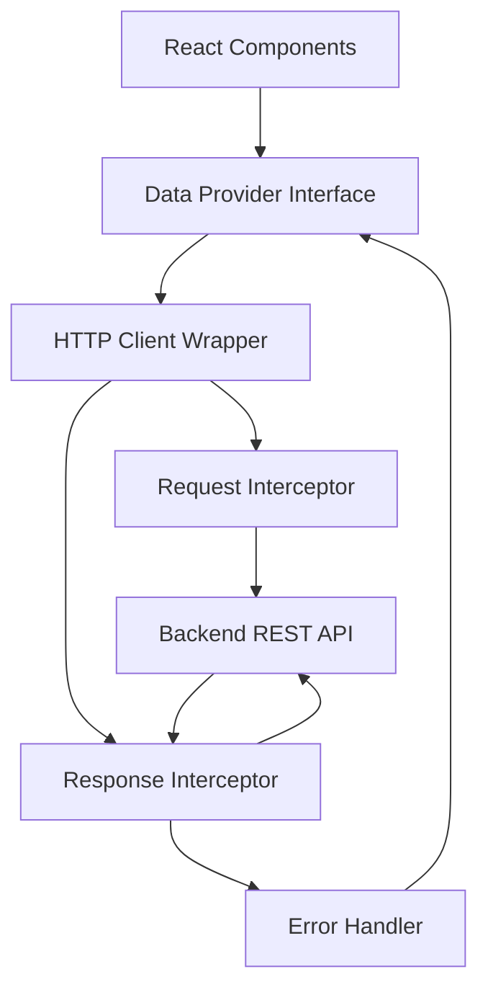

# Design Document: REST API Data Provider

## Overview

The REST API Data Provider is a TypeScript-based adapter that provides a clean, maintainable interface for communicating with backend REST APIs in a Zalo Mini App. The design follows the data provider pattern inspired by Refine, offering standardized CRUD operations, flexible configuration, custom header support, and comprehensive error handling.

The provider will be implemented as a factory function that returns an object implementing the `DataProvider` interface. It will use the native `fetch` API for HTTP requests, ensuring compatibility with the Zalo Mini App environment while maintaining simplicity and reducing dependencies.

## Architecture

### High-Level Architecture



### Layer Responsibilities

1. **Data Provider Interface**: Exposes CRUD methods (getList, getOne, create, update, deleteOne)
2. **HTTP Client Wrapper**: Handles fetch API calls with configuration
3. **Request Interceptor**: Adds headers, transforms request data, builds URLs
4. **Response Interceptor**: Transforms response data, extracts pagination metadata
5. **Error Handler**: Standardizes error formats and provides meaningful messages

### Directory Structure

```
src/
├── services/
│   ├── dataProvider/
│   │   ├── index.ts              # Main export
│   │   ├── types.ts              # TypeScript interfaces
│   │   ├── dataProvider.ts       # Core implementation
│   │   ├── httpClient.ts         # HTTP client wrapper
│   │   ├── errorHandler.ts       # Error transformation
│   │   ├── utils.ts              # Helper functions
│   │   └── __tests__/            # Test files
│   │       ├── dataProvider.test.ts
│   │       ├── httpClient.test.ts
│   │       └── errorHandler.test.ts
```

## Components and Interfaces

### Core Types

```typescript
// types.ts

export interface DataProvider {
  getList: <T = any>(params: GetListParams) => Promise<GetListResult<T>>;
  getOne: <T = any>(params: GetOneParams) => Promise<GetOneResult<T>>;
  create: <T = any>(params: CreateParams) => Promise<CreateResult<T>>;
  update: <T = any>(params: UpdateParams) => Promise<UpdateResult<T>>;
  deleteOne: <T = any>(params: DeleteOneParams) => Promise<DeleteOneResult>;
  custom: <T = any>(params: CustomParams) => Promise<CustomResult<T>>;
}

export interface GetListParams {
  resource: string;
  pagination?: {
    page: number;
    pageSize: number;
  };
  sort?: {
    field: string;
    order: 'asc' | 'desc';
  }[];
  filters?: Filter[];
  meta?: Record<string, any>;
}

export interface GetListResult<T> {
  data: T[];
  total: number;
  page?: number;
  pageSize?: number;
}

export interface GetOneParams {
  resource: string;
  id: string | number;
  meta?: Record<string, any>;
}

export interface GetOneResult<T> {
  data: T;
}

export interface CreateParams {
  resource: string;
  variables: Record<string, any>;
  meta?: Record<string, any>;
}

export interface CreateResult<T> {
  data: T;
}

export interface UpdateParams {
  resource: string;
  id: string | number;
  variables: Record<string, any>;
  meta?: Record<string, any>;
}

export interface UpdateResult<T> {
  data: T;
}

export interface DeleteOneParams {
  resource: string;
  id: string | number;
  meta?: Record<string, any>;
}

export interface DeleteOneResult {
  data: Record<string, any>;
}

export interface CustomParams {
  url: string;
  method: 'GET' | 'POST' | 'PUT' | 'PATCH' | 'DELETE';
  payload?: Record<string, any>;
  query?: Record<string, any>;
  headers?: HeadersInit;
  meta?: Record<string, any>;
}

export interface CustomResult<T> {
  data: T;
}

export interface Filter {
  field: string;
  operator: 'eq' | 'ne' | 'lt' | 'lte' | 'gt' | 'gte' | 'in' | 'nin' | 'contains' | 'ncontains';
  value: any;
}

export interface DataProviderConfig {
  apiUrl: string;
  headers?: HeadersInit | (() => HeadersInit | Promise<HeadersInit>);
  httpClient?: HttpClient;
  transformRequest?: (data: any) => any;
  transformResponse?: (data: any) => any;
  errorHandler?: (error: any) => Error;
}

export interface HttpClient {
  (url: string, options?: RequestInit): Promise<Response>;
}

export interface ApiError extends Error {
  statusCode?: number;
  errors?: Record<string, string[]>;
}
```

### Data Provider Factory

```typescript
// dataProvider.ts

export const createDataProvider = (config: DataProviderConfig): DataProvider => {
  const {
    apiUrl,
    headers: configHeaders,
    httpClient = fetch,
    transformRequest,
    transformResponse,
    errorHandler: customErrorHandler,
  } = config;

  const getHeaders = async (): Promise<HeadersInit> => {
    if (typeof configHeaders === 'function') {
      return await configHeaders();
    }
    return configHeaders || {};
  };

  const buildUrl = (resource: string, id?: string | number): string => {
    const baseUrl = apiUrl.endsWith('/') ? apiUrl.slice(0, -1) : apiUrl;
    const path = id ? `${resource}/${id}` : resource;
    return `${baseUrl}/${path}`;
  };

  const handleRequest = async <T>(
    url: string,
    options: RequestInit = {}
  ): Promise<T> => {
    try {
      const headers = await getHeaders();
      const response = await httpClient(url, {
        ...options,
        headers: {
          'Content-Type': 'application/json',
          ...headers,
          ...(options.headers || {}),
        },
      });

      if (!response.ok) {
        throw await handleError(response);
      }

      const data = await response.json();
      return transformResponse ? transformResponse(data) : data;
    } catch (error) {
      if (customErrorHandler) {
        throw customErrorHandler(error);
      }
      throw error;
    }
  };

  return {
    getList: async <T = any>(params: GetListParams): Promise<GetListResult<T>> => {
      const { resource, pagination, sort, filters, meta } = params;
      const url = buildUrl(resource);
      const queryParams = buildQueryParams({ pagination, sort, filters });
      const fullUrl = queryParams ? `${url}?${queryParams}` : url;

      const result = await handleRequest<any>(fullUrl, {
        method: 'GET',
        ...meta,
      });

      return {
        data: result.data || result,
        total: result.total || result.data?.length || 0,
        page: pagination?.page,
        pageSize: pagination?.pageSize,
      };
    },

    getOne: async <T = any>(params: GetOneParams): Promise<GetOneResult<T>> => {
      const { resource, id, meta } = params;
      const url = buildUrl(resource, id);

      const result = await handleRequest<any>(url, {
        method: 'GET',
        ...meta,
      });

      return {
        data: result.data || result,
      };
    },

    create: async <T = any>(params: CreateParams): Promise<CreateResult<T>> => {
      const { resource, variables, meta } = params;
      const url = buildUrl(resource);
      const body = transformRequest ? transformRequest(variables) : variables;

      const result = await handleRequest<any>(url, {
        method: 'POST',
        body: JSON.stringify(body),
        ...meta,
      });

      return {
        data: result.data || result,
      };
    },

    update: async <T = any>(params: UpdateParams): Promise<UpdateResult<T>> => {
      const { resource, id, variables, meta } = params;
      const url = buildUrl(resource, id);
      const body = transformRequest ? transformRequest(variables) : variables;

      const result = await handleRequest<any>(url, {
        method: 'PUT',
        body: JSON.stringify(body),
        ...meta,
      });

      return {
        data: result.data || result,
      };
    },

    deleteOne: async (params: DeleteOneParams): Promise<DeleteOneResult> => {
      const { resource, id, meta } = params;
      const url = buildUrl(resource, id);

      const result = await handleRequest<any>(url, {
        method: 'DELETE',
        ...meta,
      });

      return {
        data: result.data || result || { id },
      };
    },

    custom: async <T = any>(params: CustomParams): Promise<CustomResult<T>> => {
      const { url, method, payload, query, headers: customHeaders, meta } = params;
      
      let fullUrl = url.startsWith('http') ? url : `${apiUrl}/${url}`;
      
      if (query) {
        const queryString = new URLSearchParams(
          Object.entries(query).map(([key, value]) => [key, String(value)])
        ).toString();
        fullUrl = queryString ? `${fullUrl}?${queryString}` : fullUrl;
      }

      const result = await handleRequest<any>(fullUrl, {
        method,
        body: payload ? JSON.stringify(payload) : undefined,
        headers: customHeaders,
        ...meta,
      });

      return {
        data: result.data || result,
      };
    },
  };
};
```

### HTTP Client Wrapper

```typescript
// httpClient.ts

export const createHttpClient = (
  baseConfig?: RequestInit
): HttpClient => {
  return async (url: string, options?: RequestInit): Promise<Response> => {
    const config: RequestInit = {
      ...baseConfig,
      ...options,
      headers: {
        ...(baseConfig?.headers || {}),
        ...(options?.headers || {}),
      },
    };

    return fetch(url, config);
  };
};
```

### Error Handler

```typescript
// errorHandler.ts

export const handleError = async (response: Response): Promise<ApiError> => {
  const error: ApiError = new Error('An error occurred');
  error.statusCode = response.status;

  try {
    const data = await response.json();
    error.message = data.message || data.error || response.statusText;
    error.errors = data.errors;
  } catch {
    error.message = response.statusText;
  }

  return error;
};

export const createErrorHandler = () => {
  return (error: any): ApiError => {
    if (error instanceof Error && 'statusCode' in error) {
      return error as ApiError;
    }

    const apiError: ApiError = new Error(
      error.message || 'An unexpected error occurred'
    );
    apiError.statusCode = error.statusCode || 500;

    return apiError;
  };
};
```

### Utility Functions

```typescript
// utils.ts

export const buildQueryParams = (params: {
  pagination?: { page: number; pageSize: number };
  sort?: { field: string; order: 'asc' | 'desc' }[];
  filters?: Filter[];
}): string => {
  const queryParams = new URLSearchParams();

  if (params.pagination) {
    queryParams.append('page', params.pagination.page.toString());
    queryParams.append('pageSize', params.pagination.pageSize.toString());
  }

  if (params.sort && params.sort.length > 0) {
    params.sort.forEach((s) => {
      queryParams.append('sort', `${s.field}:${s.order}`);
    });
  }

  if (params.filters && params.filters.length > 0) {
    params.filters.forEach((f) => {
      queryParams.append(`filter[${f.field}][${f.operator}]`, String(f.value));
    });
  }

  return queryParams.toString();
};

export const generateResourceUrl = (
  baseUrl: string,
  resource: string,
  id?: string | number
): string => {
  const cleanBaseUrl = baseUrl.endsWith('/') ? baseUrl.slice(0, -1) : baseUrl;
  const path = id ? `${resource}/${id}` : resource;
  return `${cleanBaseUrl}/${path}`;
};
```

## Data Models

### Request Flow Data Model

```typescript
// Request lifecycle
interface RequestContext {
  url: string;
  method: 'GET' | 'POST' | 'PUT' | 'PATCH' | 'DELETE';
  headers: HeadersInit;
  body?: string;
  timestamp: number;
}

// Response lifecycle
interface ResponseContext {
  status: number;
  statusText: string;
  data: any;
  headers: Headers;
  timestamp: number;
}
```

### Configuration Model

```typescript
// Environment-based configuration
interface EnvironmentConfig {
  development: {
    apiUrl: string;
    timeout: number;
    retries: number;
  };
  staging: {
    apiUrl: string;
    timeout: number;
    retries: number;
  };
  production: {
    apiUrl: string;
    timeout: number;
    retries: number;
  };
}
```

## Correctness Properties

*A property is a characteristic or behavior that should hold true across all valid executions of a system—essentially, a formal statement about what the system should do. Properties serve as the bridge between human-readable specifications and machine-verifiable correctness guarantees.*

### Property 1: URL Construction Consistency

*For any* base URL, resource name, and optional ID (string or number), building a URL should always produce a valid, well-formed URL with the correct base URL prepended, resource path, and ID segment when provided.

**Validates: Requirements 1.2, 1.4, 1.5, 3.1**

### Property 2: Header Merging and Evaluation

*For any* set of configured headers (including function-based headers) and request-specific headers, the final request headers should contain all unique headers with request-specific headers taking precedence, and all header functions should be evaluated before the request.

**Validates: Requirements 2.1, 2.2, 2.3, 2.4**

### Property 3: Query Parameter Serialization Completeness

*For any* combination of pagination parameters (page, pageSize), sort parameters (field, order), and filter parameters (field, operator, value), serializing them to query string format should include all provided parameters in the correct format.

**Validates: Requirements 6.1, 6.2, 6.3, 7.1, 7.2**

### Property 4: CRUD Operation HTTP Method Correctness

*For any* CRUD operation (getList, getOne, create, update, deleteOne), the data provider should make an HTTP request with the correct method (GET for getList/getOne, POST for create, PUT for update, DELETE for deleteOne) and correct URL construction.

**Validates: Requirements 1.1, 1.2, 1.3, 1.4, 1.5**

### Property 5: Error Transformation Consistency

*For any* HTTP response with a 4xx or 5xx status code, or network error, the error handler should produce an ApiError with a status code (when available) and a non-empty error message.

**Validates: Requirements 4.1, 4.2, 4.3**

### Property 6: Response Data Extraction and Transformation

*For any* API response, the data provider should correctly extract data (unwrapping from "data" field if present, or returning as-is), apply response transformation if configured, and preserve pagination metadata (total, page, pageSize) when present.

**Validates: Requirements 5.1, 5.3, 7.3**

### Property 7: Request Transformation Application

*For any* request data and configured transformation function, the transformation should be applied to all create and update operations, producing consistent output for the same input.

**Validates: Requirements 5.2**

### Property 8: Pagination Offset Conversion

*For any* page number and page size, converting to offset-based pagination should produce the correct offset value (offset = (page - 1) * pageSize).

**Validates: Requirements 7.4**

### Property 9: Custom Request Configuration

*For any* custom request with a URL, method, optional payload, optional query parameters, and optional headers, the data provider should construct the correct full URL, include query parameters in the URL, merge custom headers with global headers, and send the payload in the request body when provided.

**Validates: Requirements 10.1, 10.2, 10.3, 10.4, 10.5**


## Error Handling

### Error Categories

1. **Network Errors**: Connection failures, timeouts, DNS resolution failures
2. **Client Errors (4xx)**: Bad requests, unauthorized, forbidden, not found
3. **Server Errors (5xx)**: Internal server errors, service unavailable
4. **Validation Errors**: Invalid parameters, missing required fields
5. **Transformation Errors**: Failed request/response transformations

### Error Response Format

```typescript
interface ApiError extends Error {
  name: 'ApiError';
  message: string;
  statusCode?: number;
  errors?: Record<string, string[]>; // Field-level validation errors
  originalError?: any;
}
```

### Error Handling Strategy

1. **Catch all errors** in the `handleRequest` function
2. **Transform HTTP errors** using `handleError` function
3. **Provide custom error handler** option for application-specific error handling
4. **Include original error** for debugging purposes
5. **Standardize error format** across all operations

## Testing Strategy

### Unit Testing

We will use **Vitest** as the testing framework for this project, as it integrates well with Vite and provides fast, modern testing capabilities.

**Test Coverage Areas:**
- URL building with various resource and ID combinations
- Header merging with different configurations
- Query parameter serialization for pagination, sorting, and filtering
- Error handling for different HTTP status codes
- CRUD operation method calls and response handling
- Request and response transformation functions

**Example Unit Tests:**
- Test `buildUrl` with resource only
- Test `buildUrl` with resource and numeric ID
- Test `buildUrl` with resource and string ID
- Test `buildQueryParams` with pagination only
- Test `buildQueryParams` with filters only
- Test `buildQueryParams` with all parameters
- Test error handler with 404 response
- Test error handler with 500 response
- Test header merging with overlapping keys

### Property-Based Testing

We will use **fast-check** for property-based testing in TypeScript.

**Property Test Configuration:**
- Minimum 100 iterations per property test
- Each test tagged with: **Feature: rest-api-data-provider, Property {number}: {property_text}**

**Property Test Implementation:**
- Generate random resource names, IDs, and parameters
- Verify URL construction properties
- Verify header merging properties
- Verify query parameter serialization round-trip
- Verify error transformation properties
- Verify CRUD operation HTTP method mapping

### Integration Testing

- Test complete request/response cycle with mock server
- Test authentication header injection
- Test error scenarios end-to-end
- Test with different backend response formats

### Test Organization

```
src/services/dataProvider/__tests__/
├── dataProvider.test.ts          # Unit tests for main provider
├── dataProvider.property.test.ts # Property-based tests
├── httpClient.test.ts            # HTTP client tests
├── errorHandler.test.ts          # Error handler tests
├── utils.test.ts                 # Utility function tests
└── integration.test.ts           # Integration tests
```

## Usage Examples

### Basic Setup

```typescript
// src/services/api.ts
import { createDataProvider } from '@/services/dataProvider';

export const dataProvider = createDataProvider({
  apiUrl: import.meta.env.VITE_API_URL || 'https://api.example.com',
  headers: () => ({
    'Authorization': `Bearer ${getAccessToken()}`,
    'X-App-Version': '1.0.0',
  }),
});
```

### Using with React Component

```typescript
// src/pages/users.tsx
import { useEffect, useState } from 'react';
import { dataProvider } from '@/services/api';

interface User {
  id: number;
  name: string;
  email: string;
}

function UsersPage() {
  const [users, setUsers] = useState<User[]>([]);
  const [loading, setLoading] = useState(true);

  useEffect(() => {
    const fetchUsers = async () => {
      try {
        const result = await dataProvider.getList<User>({
          resource: 'users',
          pagination: { page: 1, pageSize: 10 },
          sort: [{ field: 'name', order: 'asc' }],
        });
        setUsers(result.data);
      } catch (error) {
        console.error('Failed to fetch users:', error);
      } finally {
        setLoading(false);
      }
    };

    fetchUsers();
  }, []);

  return (
    <div>
      {loading ? <p>Loading...</p> : (
        <ul>
          {users.map(user => (
            <li key={user.id}>{user.name}</li>
          ))}
        </ul>
      )}
    </div>
  );
}
```

### Using with Jotai

```typescript
// src/atoms/users.ts
import { atom } from 'jotai';
import { dataProvider } from '@/services/api';

export const usersAtom = atom(async () => {
  const result = await dataProvider.getList({
    resource: 'users',
    pagination: { page: 1, pageSize: 20 },
  });
  return result.data;
});

// In component
import { useAtom } from 'jotai';
import { usersAtom } from '@/atoms/users';

function UsersList() {
  const [users] = useAtom(usersAtom);
  // ... render users
}
```

### Custom Error Handling

```typescript
const dataProvider = createDataProvider({
  apiUrl: 'https://api.example.com',
  errorHandler: (error) => {
    if (error.statusCode === 401) {
      // Redirect to login
      window.location.href = '/login';
    }
    return error;
  },
});
```

### Request/Response Transformation

```typescript
const dataProvider = createDataProvider({
  apiUrl: 'https://api.example.com',
  transformRequest: (data) => ({
    ...data,
    timestamp: Date.now(),
  }),
  transformResponse: (data) => {
    // Backend wraps data in { success: true, payload: {...} }
    return data.payload;
  },
});
```

### Custom API Calls

```typescript
// Custom GET request
const stats = await dataProvider.custom({
  url: 'analytics/stats',
  method: 'GET',
  query: {
    startDate: '2024-01-01',
    endDate: '2024-12-31',
  },
});

// Custom POST request (mutation)
const result = await dataProvider.custom({
  url: 'users/bulk-import',
  method: 'POST',
  payload: {
    users: [
      { name: 'John', email: 'john@example.com' },
      { name: 'Jane', email: 'jane@example.com' },
    ],
  },
  headers: {
    'X-Import-Mode': 'async',
  },
});

// Custom endpoint with full URL
const externalData = await dataProvider.custom({
  url: 'https://external-api.com/data',
  method: 'GET',
});
```

